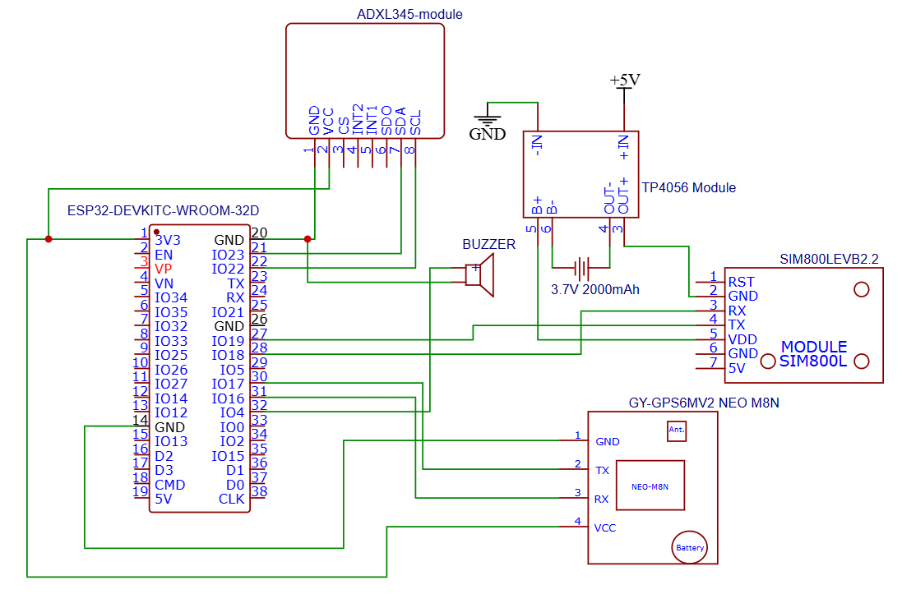

<h1 align="center">
⛑️ Smart Hard Hat with Impact Emergency Location Detector for Instant Disaster Response 🚨
</h1>

<b><i>Safe heads equals happy heads.</i></b>

## 📑 Table of Contents
* [Required Components](#required-components)
* [Schematic Diagram](#schematic-diagram)

# SHIELD 
To properly set up the code, the libraries must be installed into your computer. Download the libraries folder as zip file and then extract the contents to your Arduino folder.

## Required Components
1. 1 ESP32 microcontroller
2. 1 ADXL345 module
3. 1 SIM800L EVB module
4. 1 NEO-M8N GPS module
5. 1 buzzer
6. 1 3.7V LiPo battery
7. 1 TP4056 module

## Schematic Diagram

## Instructions
When soldering the accelerometer module make sure that the chip faces upward inside the closure. This helps ensure that the readings on the z-axis are close to 1g.

Read this [article](karatonis2006.pdf) for more information regarding real-time human movement using accelerometers.