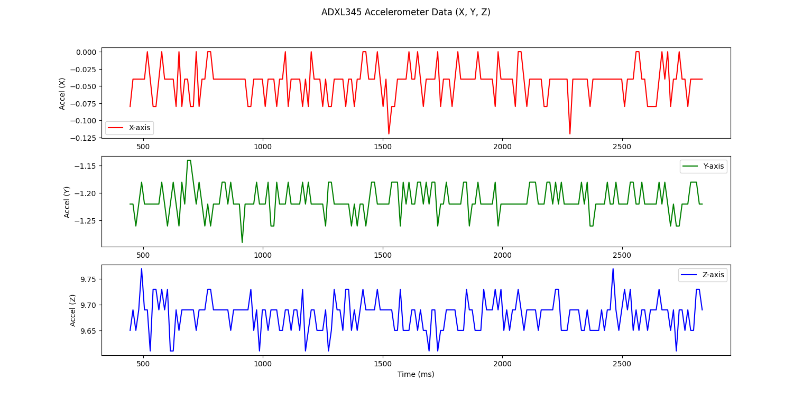
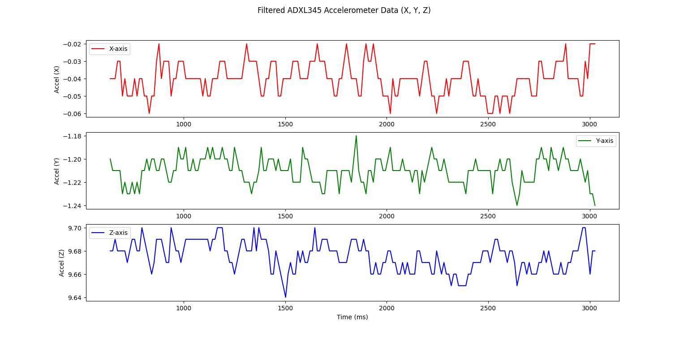

# Graph Experiments
I'd like to share some graphs I've made while messing around with the accelerometer.

## Range: -/+16g @ 100 Hz
You can pretty much see how far the fluctuations are from each other and from their true values.
This was taken when the accelerometer was sitting still in a chair. Their acceleration values should be 0, 0, 9.81
in the x, y, and z axes respectively.



## Implementing a Low Pass Filter
The low pass filter is a vector under the ADXL345 library, the formula used in the code is shown below

```
Vector ADXL345::lowPassFilter(Vector vector, float alpha)
{
    f.XAxis = vector.XAxis * alpha + (f.XAxis * (1.0 - alpha));
    f.YAxis = vector.YAxis * alpha + (f.YAxis * (1.0 - alpha));
    f.ZAxis = vector.ZAxis * alpha + (f.ZAxis * (1.0 - alpha));
    return f;
}
```
$a_{filtered} = a\cdot\alpha + {(a_{filtered}(1.0-\alpha))}$<br>

This is a recursive equation that takes the initial values of $a_x$, $a_y$, and $a_z$ as well as their filtered values to 
filter noise. The values of f.XAxis, f.YAxis, and f.ZAxis are all set to 0 initially.

## Alpha Values
When I tried changing the alpha value, the graph seems to behave differently to filter out the noise.
```
accelerometer.lowPassFilter(norm, 0.13);
```

```
accelerometer.lowPassFilter(norm, 0.3);
```


Feel free to let me know your interpretations regarding this, I have started researching on this topic 
and it led me down the rabbit hole. The graphs often interpret a signal and how various variables can affect it. 
This field focuses more on the digital signal processing (DSP) side. 
